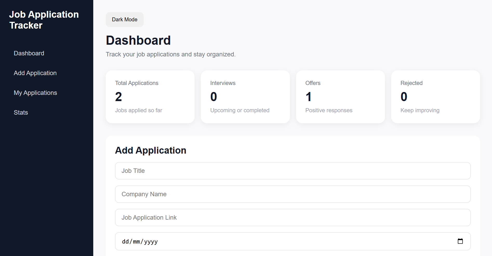
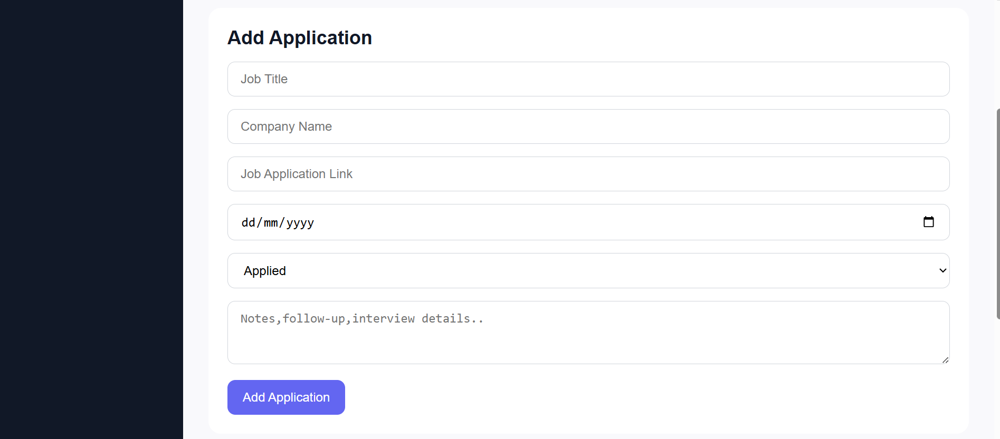
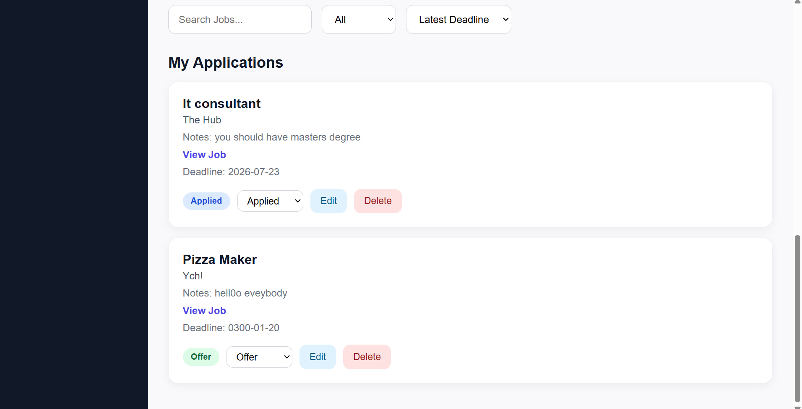
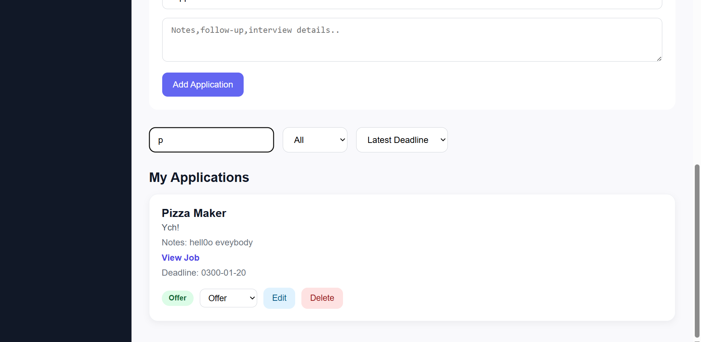
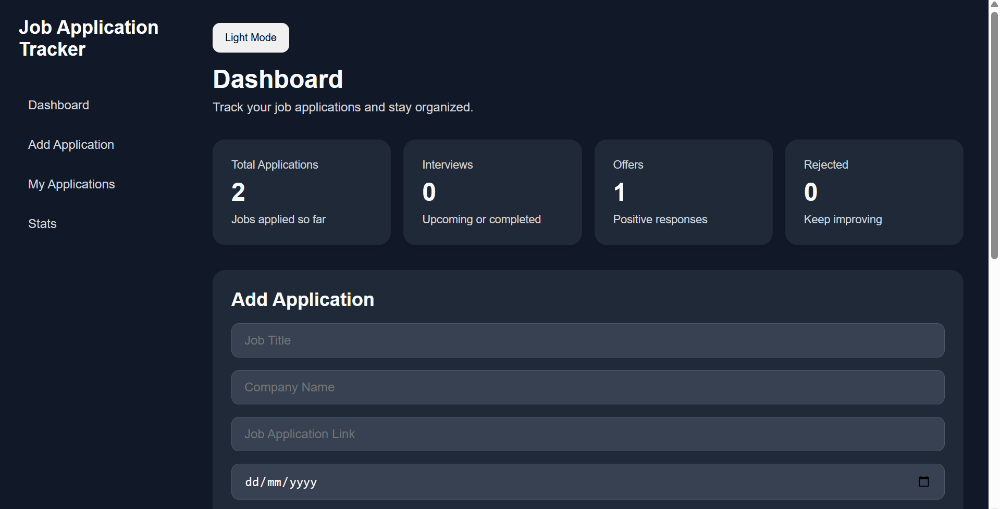

# 💼 Job Tracker App

A modern job application tracking application built with **React** that helps users organize and manage their job search in one place.

The application enables users to add, edit, and manage job applications, track their progress through different hiring stages, save interview notes, monitor application deadlines, and organize their job search through a clean, responsive, and intuitive user interface.

---

## 🚀 Live Demo

🔗 **Live Demo:** https://job-tracker-app-drab.vercel.app/

## 💻 GitHub Repository

🔗 **GitHub:** https://github.com/Ujjwal-Darnal/Job-Tracker-App

---

## ✨ Features

- ✅ Add new job applications
- ✅ Edit existing job applications
- ✅ Delete job applications
- ✅ Track application status (Applied, Interview, Offer, Rejected)
- ✅ Search jobs by company or job title
- ✅ Filter jobs by application status
- ✅ Sort jobs by application deadline
- ✅ Dashboard with application statistics
- ✅ Store interview notes
- ✅ Save job posting links
- ✅ Track application deadlines
- ✅ Dark Mode support
- ✅ Local Storage persistence
- ✅ Responsive design for desktop and mobile devices

---

## 🛠 Tech Stack

- ⚛️ React
- 🟨 JavaScript (ES6+)
- ⚡ Vite
- 🎨 CSS3
- 💾 Local Storage

---

## 📷 Screenshots

### 📊 Dashboard



---

### ➕ Add Job Application



---

### 📋 My Applications



---

### 🔍 Search & Filter



---

### 🌙 Dark Mode



---

## 📚 What I Learned

Building this project helped me strengthen my React fundamentals by developing a complete CRUD application that solves a real-world problem.

Throughout the project, I practiced:

- Managing application state using React Hooks
- Building reusable and maintainable React components
- Working with controlled forms
- Implementing complete CRUD functionality
- Searching, filtering, and sorting application data
- Conditional rendering
- Persisting application data using Local Storage
- Creating responsive layouts with CSS
- Organizing scalable React project structures
- Writing cleaner, more maintainable code

---

## ⚙️ Installation

Clone the repository

```bash
git clone https://github.com/Ujjwal-Darnal/Job-Tracker-App.git
```

Navigate to the project directory

```bash
cd Job-Tracker-App
```

Install dependencies

```bash
npm install
```

Start the development server

```bash
npm run dev
```

Open your browser and visit:

```
http://localhost:5173
```

---

## 🔮 Future Improvements

- 🔐 User Authentication
- ☁️ Cloud Database Integration (Firebase or Supabase)
- 📄 Resume Upload
- 📧 Email Follow-up Reminders
- 📅 Calendar Integration
- 📊 Advanced Analytics Dashboard
- 🏢 Company Logos
- 🔔 Push Notifications

---

## 👨‍💻 Author

**Ujjwal Darnal**

- GitHub: https://github.com/Ujjwal-Darnal
- LinkedIn: https://www.linkedin.com/in/ujjwal-darnal/

---

⭐ If you found this project interesting, feel free to give the repository a star!